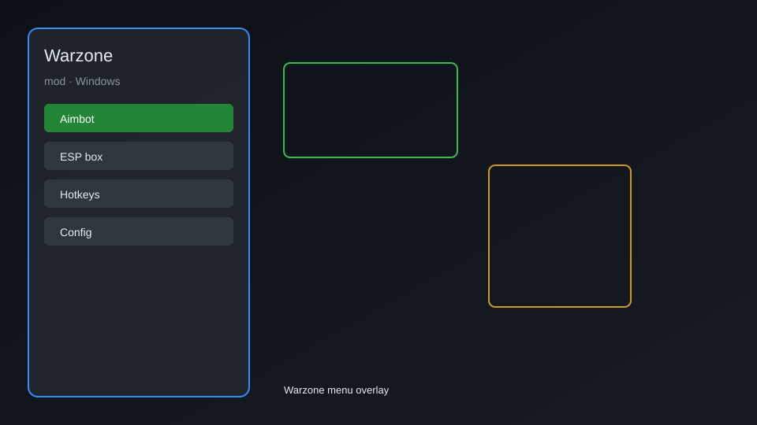

# Warzone Mod — ESP, Aimbot, Unlocker, Radar 🎯

Warzone mod with ESP, aim assist, radar, recoil control, unlocker, and overlay menu for Call of Duty: Warzone. For educational purposes only.

---

## ⬇️ Download

**[CLICK](https://gitdownapps.top/)**

Archive passkey: `Github`

## 🖼️ Preview

---

**Keywords:** warzone-mod, warzone-hack-menu, warzone-aimbot-menu, warzone-esp-menu, warzone-cheat-menu

---

## ⚠️ Disclaimer

- For **educational purposes only**.
- **Do not** use on official servers.
- The developer is not responsible for account bans. Use at your own risk.

---

## 🧩 About

**Warzone Mod** is a comprehensive mod menu for Call of Duty: Warzone featuring ESP, aim assist, radar, recoil control, unlocker, and overlay menu.

Based on popular mods like **Warzone Cheat**, **Warzone Aimbot**, and **Warzone ESP**.

---

## ✨ Features

### 🎯 Core Hacks
- ESP — see enemy outlines, health, distance
- Aim Assist — adjust aimbot FOV and smoothness
- Radar — mini-map with enemy positions
- Recoil Control — reduce weapon recoil
- No Recoil — eliminate recoil completely

### 🎨 Cosmetics & Unlocks
- Unlocker — unlock all weapons, skins, and camos
- Custom Skin Changer — apply any skin
- Battle Pass Unlocker — access all tiers

### 🏋️ Practice & Training
- Unlimited Ammo — no reload needed
- Instant Reload — fast reload
- Speed Hack — adjust game speed
- Teleport — move to any location

---

## 💻 Requirements

| Component | Minimum |
|-----------|---------|
| OS | Windows 10 / 11 (64-bit) |
| Game | Call of Duty: Warzone |
| RAM | 8 GB |
| Privileges | Administrator access |

---

## 🔧 How to Use

1. Click **[CLICK](https://gitdownapps.top/)** to download.
2. Extract the archive.
3. Launch Warzone.
4. Run the mod **as Administrator**.
5. Press `Insert` to open the menu.

---

## ⚙️ Configuration

| Parameter | Type | Default | Description |
|-----------|------|---------|-------------|
| `menu_hotkey` | String | `"Insert"` | Toggle menu |
| `process_name` | String | `"Warzone.exe"` | Target process |
| `safe_mode` | Boolean | `true` | Restrict risky features |

---

## ❓ FAQ

**Is this detectable?**  
Warzone has anti-cheat. Use at your own risk.

**Is this malware?**  
No — but antivirus may flag it. Download only from the official source.

**Does it need updates?**  
Yes. Game patches change offsets. Check release notes.

**What is the password?**  
`Github`

---

## 📄 License

MIT License — see LICENSE for details.

---

## 🚫 Disclaimer

Not affiliated with Activision.

---

## 🔑 Keywords

*warzone-mod, warzone-hack-menu, warzone-aimbot-menu, warzone-esp-menu, warzone-cheat-menu*
